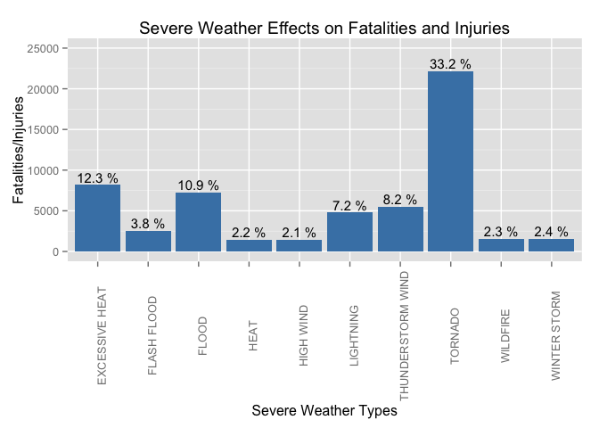
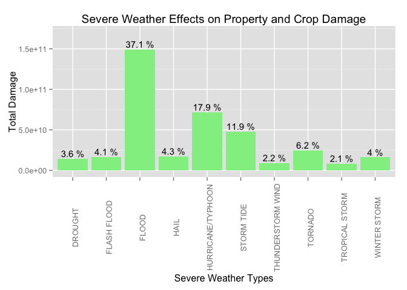

# Impacts of Severe Weather Events in the United States Between 1996 and 2011

## Synopsis
This project examines the impacts of severe weather events, as reported in the U.S. National Oceanic and Atmospheric Administration's (NOAA) storm database. This database tracks characteristics of severe weather events in the United States, including when and where they occur, as well as estimates of any fatalities, injuries, and property damage.  The data analysis examines the human cost (fatalities and injuries) and economic cost (property and crop damage) caused by the most severe storm events.

## Data Processing

The data set is available from the course website (https://d396qusza40orc.cloudfront.net/repdata%2Fdata%2FStormData.csv.bz2), but is also available from the NOAA website (http://www.ncdc.noaa.gov/stormevents/details.jsp?type=eventtype). To make the dataset more manageable, the data will be pre-processed to just include the relevant years (1996-2011) and the relevant variables.  Because the descriptions listed for severe weather events don't always completely match the standardized descriptions, the most frequently used ones will be corrected.

### Loading the dataset

```
## 
## Attaching package: 'dplyr'
```

```
## The following objects are masked from 'package:plyr':
## 
##     arrange, count, desc, failwith, id, mutate, rename, summarise,
##     summarize
```

```
## The following objects are masked from 'package:stats':
## 
##     filter, lag
```

```
## The following objects are masked from 'package:base':
## 
##     intersect, setdiff, setequal, union
```

```
## Warning: package 'stringdist' was built under R version 3.2.3
```


```r
## Download the dataset and load into memory
download.file("https://d396qusza40orc.cloudfront.net/repdata%2Fdata%2FStormData.csv.bz2", "StormData.csv.bz2")
StormData <- read.csv("StormData.csv.bz2")
dim(StormData)
```

```
## [1] 902297     37
```

Examining the dataset, there are 902,297 observations and 37 variables with the following variable names:

```r
names(StormData)
```

```
##  [1] "STATE__"    "BGN_DATE"   "BGN_TIME"   "TIME_ZONE"  "COUNTY"    
##  [6] "COUNTYNAME" "STATE"      "EVTYPE"     "BGN_RANGE"  "BGN_AZI"   
## [11] "BGN_LOCATI" "END_DATE"   "END_TIME"   "COUNTY_END" "COUNTYENDN"
## [16] "END_RANGE"  "END_AZI"    "END_LOCATI" "LENGTH"     "WIDTH"     
## [21] "F"          "MAG"        "FATALITIES" "INJURIES"   "PROPDMG"   
## [26] "PROPDMGEXP" "CROPDMG"    "CROPDMGEXP" "WFO"        "STATEOFFIC"
## [31] "ZONENAMES"  "LATITUDE"   "LONGITUDE"  "LATITUDE_E" "LONGITUDE_"
## [36] "REMARKS"    "REFNUM"
```

### Pre-processing to make the dataset more manageable
According to the following noaa information: http://www.ncdc.noaa.gov/stormevents/details.jsp?type=eventtype, only storm events for tornado, hail, thunderstorm and wind were recorded from 1953 to 1995.  Starting in 1996, 48 unique storm events were recorded, so we will only examine data for the years 1996 - 2011.  This reduces the dataset from approximately 900,000 observations to about 650,000.


```r
## Subset data only for years >= 1996
StormData <- subset(StormData, (strptime(StormData$BGN_DATE,"%m/%d/%Y")$year + 1900) >= "1996")
## Also remove any rows with EVTYPE = NA
StormData <- filter(StormData, !is.na(EVTYPE))
## Capitalize the EVTYPE entries
StormData$EVTYPE <- toupper(StormData$EVTYPE)
```

Only some of the 37 variables will be important to an analysis of severe weather and the impact to fatalities, injuries and property damage. The variables are defined in the following document: https://ire.org/media/uploads/files/datalibrary/samplefiles/Storm%20Events/layout08.doc  

Only the following 9 variables are relevant to the analysis and will be kept:   

* BGN_DATE - Date the storm event began
* STATE - 2-character state postal code
* EVTYPE - Type of storm event
* FATALITIES - Number directly killed
* INJURIES - Number directly injured
* PROPDMG - Property damage in whole numbers and hundredths
* PROPDMGEXP - A multiplier where Hundred (H), Thousand (K), Million (M), Billion (B)
* CROPDMG - Crop damage in whole numbers and hundredths
* CROPDMGEXP - A multiplier where Hundred (H), Thousand (K), Million (M), Billion (B)


```r
## Keep only the 9 relevant variables
StormData <- select(StormData, c(BGN_DATE, STATE, EVTYPE, FATALITIES, INJURIES, PROPDMG, PROPDMGEXP, CROPDMG, CROPDMGEXP))
```


### Dataset correction process for the type of storm events recorded
The types of severe weather events recorded under column EVTYPE often have typographical errors or don't match the master list from the National Weather Service storm data documentation (http://www.ncdc.noaa.gov/stormevents/pd01016005curr.pdf).  In order to correct this, the first step is to create an events master list from the National Weather Service storm data documentation, and then examine what percentage of the recorded events match.


```r
## Manually create the master list of 48 unique storm events
events <- c("ASTRONOMICAL LOW TIDE ","AVALANCHE", "BLIZZARD", "COASTAL FLOOD",
        "COLD/WIND CHILL", "DEBRIS FLOW", "DENSE FOG", "DENSE SMOKE", "DROUGHT", 
        "DUST DEVIL", "DUST STORM", "EXCESSIVE HEAT", "EXTREME COLD/WIND CHILL", 
        "FLASH FLOOD", "FLOOD", "FREEZING FOG", "FROST/FREEZE", "FUNNEL CLOUD","HAIL",
        "HEAT", "HEAVY RAIN", "HEAVY SNOW", "HIGH SURF", "HIGH WIND",
        "HURRICANE/TYPHOON", "ICE STORM", "LAKESHORE FLOOD", "LAKE-EFFECT SNOW",
        "LIGHTNING", "MARINE HAIL", "MARINE HIGH WIND", "MARINE STRONG WIND", 
        "MARINE THUNDERSTORM WIND", "RIP CURRENT", "SEICHE", "SLEET", "STORM TIDE",
        "STRONG WIND", "THUNDERSTORM WIND", "TORNADO", "TROPICAL DEPRESSION",
        "TROPICAL STORM", "TSUNAMI", "VOLCANIC ASH", "WATERSPOUT", "WILDFIRE",
        "WINTER STORM", "WINTER WEATHER")

##  Check to see how much EVTYPE values match the master list
evtype <- plyr::count(StormData, 'EVTYPE')
match <- amatch(evtype$EVTYPE, events, maxDist = 2)
evtype$match <- match 
match_perc <- sum(filter(evtype, !is.na(match))$freq)/sum(evtype$freq)
print(paste("Initial match of EVTYPEs in storm data to the master list:", 
            round((match_perc*100),digits=2),"%"))
```

```
## [1] "Initial match of EVTYPEs in storm data to the master list: 77.29 %"
```


After seeing that only 77% of the entries match, the next step is to identify the 20 most frequent non-matches of EVTYPE vs. the master list.


```
## [1] "The 20 most frequent non-matches are:"
```

```
##                   EVTYPE   freq match
## 313            TSTM WIND 128664    NA
## 148     MARINE TSTM WIND   6175    NA
## 349 URBAN/SML STREAM FLD   3392    NA
## 366     WILD/FOREST FIRE   1443    NA
## 376   WINTER WEATHER/MIX   1104    NA
## 323       TSTM WIND/HAIL   1028    NA
## 59          EXTREME COLD    617    NA
## 131            LANDSLIDE    588    NA
## 72                   FOG    532    NA
## 219                 SNOW    425    NA
## 367                 WIND    326    NA
## 233          STORM SURGE    253    NA
## 106 HEAVY SURF/HIGH SURF    228    NA
## 61     EXTREME WINDCHILL    204    NA
## 75         FREEZING RAIN    186    NA
## 142           LIGHT SNOW    174    NA
## 44        DRY MICROBURST    173    NA
## 117            HURRICANE    170    NA
## 234     STORM SURGE/TIDE    148    NA
## 23      COASTAL FLOODING    147    NA
```

These top non-matches are manually corrected in the following ways:  

* TSTM WIND = THUNDERSTORM WIND  
* MARINE TSTM WIND = MARINE THUNDERSTORM WIND  
* URBAN/SML STREAM FLOOD = FLOOD  
* WILD/FOREST FIRE = WILDFIRE  
* WINTER WEATHER/MIX = WINTER WEATHER  
* TSTM WIND/HAIL = THUNDERSTORM WIND  
* EXTREME COLD = EXTREME COLD/WIND CHILL  
* LANDSLIDE =  DEBRIS FLOW  
* FOG = DENSE FOG  
* SNOW = HEAVY SNOW  
* WIND = HIGH WIND
* STORM SURGE = STORM TIDE
* HEAVY SURF/HIGH SURF = HIGH SURF
* EXTREME WINDCHILL = EXTREME COLD/WIND CHILL
* FREEZING RAIN = SLEET
* DRY MICROBURST = HIGH WIND
* HURRICANE = HURRICANE/TYPHOON
* LIGHT SNOW = WINTER STORM
* STORM SURGE/TIDE = STORM TIDE
* RECORD WARMTH = HEAT


```r
## Create a vector with corrected values for the top 20 non-matches
EVTYPEfixed <- c("THUNDERSTORM WIND", "MARINE THUNDERSTORM WIND", "FLOOD", "WILDFIRE", "WINTER WEATHER", "THUNDERSTORM WIND", "EXTREME COLD/WIND CHILL", "DEBRIS FLOW", "DENSE FOG", "HEAVY SNOW", "HIGH WIND", "STORM TIDE", "HIGH SURF", "EXTREME COLD/WIND CHILL", "SLEET", "HIGH WIND", "HURRICANE/TYPHOON", "WINTER STORM", "STORM TIDE", "HEAT")

## add the vector in the nonMatch data frame
nonMatch$EVTYPEfixed <- EVTYPEfixed

## copy the EVTYPE column from StormData into a character vector
EVTYPE <- as.character(StormData$EVTYPE)

for (i in 1:nrow(nonMatch)) {
        EVTYPE <- replace(EVTYPE, which(EVTYPE == nonMatch$EVTYPE[i]),
                nonMatch$EVTYPEfixed[i])
}

## Replace StormData EVTYPE with the corrected EVTYPE column
EVTYPE <- as.factor(EVTYPE)
StormData$EVTYPE <- EVTYPE
```


Next, a re-check of how many recorded events in the Storm Data match the master list is done.

```r
evtype <- plyr::count(StormData, 'EVTYPE')
match <- amatch(evtype$EVTYPE, events, maxDist = 2)
evtype$match <- match 
match_perc <- sum(filter(evtype, !is.na(match))$freq)/sum(evtype$freq)
print(paste("Match of top-20 corrected EVTYPEs in storm data to the master list:", 
            round((match_perc*100),digits=2),"%"))
```

```
## [1] "Match of top-20 corrected EVTYPEs in storm data to the master list: 99.63 %"
```

After correcting the 20 most frequent mismatches, the match percentage rose from the EVTYPE in StormData to the master list increased from 77.29% to 99.63%.  This is high enough to make further corrections unnecessary in order to effectively explore the data.


## Results

### Analysis of severe weather data and fatalities and injuries
This analysis will identify which severe weather events directly caused the human fatalities and injuries.  As a simplification, FATALITIES and INJURIES will be added together in a variable called CASUALTIES.  The next step is to build a data frame (StormCasualties) that aggregates the combined fatalities and injuries (CASUALTIES) by severe weather event types (EVTYPE).


```r
## Combine fatalities and injuries under variable casualties
StormData$CASUALTIES <- StormData$FATALITIES + StormData$INJURIES

## run aggregate function on storm events and number of casualties.  Sort in decreasing order and remove the NA values
StormCasualties <- aggregate(CASUALTIES~EVTYPE, data = StormData, sum)
StormCasualties <- StormCasualties[order(StormCasualties$CASUALTIES, decreasing = TRUE),]
StormCasualties <- filter(StormCasualties, !is.na(CASUALTIES))

# get total number of recorded casualties for percent calculations
totalCasualties <- sum(StormData$CASUALTIES)
print(paste("The top 10 severe weather events accounted for ",
            with(StormCasualties, round(sum(CASUALTIES[1:10])/totalCasualties,3)*100),
            "% of total casualties ", sep=""))
```

```
## [1] "The top 10 severe weather events accounted for 84.7% of total casualties "
```

Since the top 10 severe weather events accounted for nearly 85% of all casualties (fatalities + injuries), we'll narrow our focus to the effects of just those events and plot the data.

```r
## reduce to top 10 events 
StormCasualties <- StormCasualties[1:10,]
## Add in percentages of casualties for each event
StormCasualties$percent <- round(StormCasualties$CASUALTIES / totalCasualties,3)*100

p <- ggplot(data = StormCasualties, aes(x=EVTYPE, y = CASUALTIES)) + 
        geom_bar(stat = "identity", fill="steelblue") + 
        theme(axis.text.x = element_text(angle = 90)) +
        ylim(0,25000) +
        ylab("Fatalities/Injuries") + 
        xlab("Severe Weather Types") +
        ggtitle("Severe Weather Effects on Fatalities and Injuries") +
        geom_text(size = 4, aes(label=paste(percent,"%"), vjust=-0.3))
p
```

\


As seen in the plot, Tornados caused the most fatalities and injuries at 33.2% of total.  This figure is about the size of the next three severe weather types combined - Excessive Heat at 12.3%, Flood at 10.9% and Thunderstorm Wind at 8.2%.  Adding in the next highest event (Lightning at 7.2%), the top five events are responsible for over 72% of all the severe weather related fatalities and injuries. 

Here is the table showing the data used for the plot:

```
##               EVTYPE CASUALTIES percent
## 1            TORNADO      22178    33.2
## 2     EXCESSIVE HEAT       8188    12.3
## 3              FLOOD       7279    10.9
## 4  THUNDERSTORM WIND       5500     8.2
## 5          LIGHTNING       4792     7.2
## 6        FLASH FLOOD       2561     3.8
## 7       WINTER STORM       1590     2.4
## 8           WILDFIRE       1543     2.3
## 9               HEAT       1462     2.2
## 10         HIGH WIND       1423     2.1
```


### Analysis of severe weather data and economic impact
This analysis will identify which severe weather events caused the most property and crop damage.  As a simplification, PROPDMG and CROPDMG will be added together in a variable called DAMAGE.

The first data processing step is to multiply the PROPDMG and CROPDMP values by the appropriate multiplier.  These variables are followed by variables PROPDMGEXP and CROPDMGEXP which represent the correct multiplier: H (hundred), K (thousand), M (million) and B (billion).  Any values that do not have a multiplier are so low that we can assume them to be 0.


```r
## Set up the correct multiplier number corresponding to the EXP character
EXP <- c("H", "K", "M", "B")
EXPmult <- c(100, 1000, 1e+06, 1e+09)

## multiply the PROPDMG and CROPDMG values by the correct EXP multiplier
StormData$PROPDMG <- EXPmult[match(StormData$PROPDMGEXP, EXP)] * StormData$PROPDMG 
StormData$CROPDMG <- EXPmult[match(StormData$CROPDMGEXP, EXP)] * StormData$CROPDMG 
## zero out any values which did not have a multiplier
StormData$PROPDMG[which(is.na(StormData$PROPDMG))] <- 0
StormData$CROPDMG[which(is.na(StormData$CROPDMG))] <- 0

## Add the two values together to compute a total DAMAGE amount
StormData$DAMAGE <- StormData$PROPDMG + StormData$CROPDMG
```


The next step is to build a data frame (StormDamage) that aggregates the combined property and crop damage (DAMAGE) by severe weather event types (EVTYPE).


```r
## run aggregate function on storm events and total damage.  Sort in decreasing order and remove any NA values
StormDamage <- aggregate(DAMAGE~EVTYPE, data = StormData, sum)
StormDamage <- StormDamage[order(StormDamage$DAMAGE, decreasing = TRUE),]
StormDamage <- filter(StormDamage, !is.na(DAMAGE))

# get total amount of damage for percent calculations
totalDamage <- sum(StormData$DAMAGE)
print(paste("The top 10 severe weather events accounted for ",
            with(StormDamage, round(sum(DAMAGE[1:10])/totalDamage,3)*100),
            "% of total property and crop damage.", sep=""))
```

```
## [1] "The top 10 severe weather events accounted for 93.4% of total property and crop damage."
```

Since the top 10 severe weather events accounted for 93% of all property and crop damage, we'll narrow our focus to the effects of just those events and plot the data.


```r
## reduce to top 10 events 
StormDamage <- StormDamage[1:10,]
## Add in percentages of casualties for each event
StormDamage$percent <- round(StormDamage$DAMAGE / totalDamage,3)*100

p <- ggplot(data = StormDamage, aes(x=EVTYPE, y = DAMAGE)) + 
        geom_bar(stat = "identity", fill="lightgreen") + 
        theme(axis.text.x = element_text(angle = 90)) +
        ylim(0,1.7e+11) +
        ylab("Total Damage") + 
        xlab("Severe Weather Types") +
        ggtitle("Severe Weather Effects on Property and Crop Damage") +
        geom_text(size = 4, aes(label=paste(percent,"%"), vjust=-0.3))
p
```

\

As seen in the plot, Floods caused the greatest economic impact, with the total of property and crop damages at 37.1% of total.  This figure is about the size of the next three severe weather types combined - Hurricane / Typhoon at 17.9%, Storm Tide at 11.9% and Tornado at 6.2%.  These top four events are responsible for 73% of all the severe weather related fatalities and injuries.

One further finding is that there is little correlation between the top events that caused the greatest economic impact and the greatest human cost.  Only half of the events are common between the top 10 lists (FLASH FLOOD, FLOOD, THUNDERSTORM/WIND, TORNADO and WINTER STORM), with large differences between the magnitude of each in their respective lists.

Here is the table showing the data used for the plot:

```
##               EVTYPE       DAMAGE percent
## 1              FLOOD 148986409700    37.1
## 2  HURRICANE/TYPHOON  71915460400    17.9
## 3         STORM TIDE  47835579000    11.9
## 4            TORNADO  24900370720     6.2
## 5               HAIL  17071172870     4.3
## 6        FLASH FLOOD  16557105610     4.1
## 7       WINTER STORM  16098916260     4.0
## 8            DROUGHT  14413667000     3.6
## 9  THUNDERSTORM WIND   8921988980     2.2
## 10    TROPICAL STORM   8320186550     2.1
```


